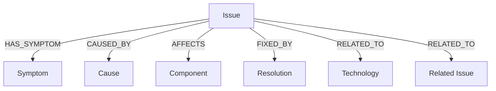

# SupportGraph

A graph-powered technical issue troubleshooting application built with CognoDB and Neo4j's official JavaScript driver.

## Overview

SupportGraph helps users explore technical issues and understand their troubleshooting information through relationships between:

- Issues
- Symptoms
- Causes
- Components
- Resolutions
- Technologies
- Related Issues

Users can search for issues, view issue details, and explore connected troubleshooting information.

## Why a Graph Database?

Troubleshooting information is highly relationship-oriented.

For example, one issue can:

- Have multiple symptoms
- Be caused by multiple causes
- Affect multiple components
- Be fixed by multiple resolutions
- Be related to other issues
- Be associated with multiple technologies

A graph database makes these connections explicit and allows the application to traverse relationships between related entities.

This is useful for queries such as finding the symptoms, causes, resolutions and technologies connected to a particular issue, as well as discovering related issues through graph relationships.

A relational database could represent these relationships using multiple tables and join tables, but multi-hop relationship queries become more complex as the number of connected entities increases.

## Features

- View all technical issues
- Search issues by name
- View detailed troubleshooting information
- Explore symptoms and causes
- View resolutions
- View related technologies
- Discover related issues
- Handle empty search results
- Handle invalid issue IDs
- REST API powered by Express.js
- Graph data stored in CognoDB
- Parameterized Cypher queries

## Technology Stack

### Backend

- Node.js
- Express.js
- JavaScript
- Neo4j Driver
- CognoDB
- dotenv
- CORS

### Database

- CognoDB
- openCypher
- Bolt protocol

### Frontend

- HTML
- CSS
- JavaScript

## Graph Data Model

The main graph contains the following node types:

- `Issue`
- `Symptom`
- `Cause`
- `Component`
- `Resolution`
- `Technology`

### Graph Relationship Diagram



The relationships include:

- `HAS_SYMPTOM`
- `CAUSED_BY`
- `AFFECTS`
- `FIXED_BY`
- `RELATED_TO`

Example:

```text
Issue
 ├── HAS_SYMPTOM ──> Symptom
 ├── CAUSED_BY ────> Cause
 ├── AFFECTS ──────> Component
 ├── FIXED_BY ─────> Resolution
 ├── RELATED_TO ───> Issue
 └── RELATED_TO ───> Technology

## API Endpoints

### Health Check

GET `/api/health`

Checks whether the SupportGraph API is running.

### Get All Issues

GET `/api/issues`

Returns all technical issues.

### Search Issues

GET `/api/issues/search?q=API`

Searches issues by name.

Example:

GET `/api/issues/search?q=API`

### Get Issue by ID

GET `/api/issues/:issueId`

Returns a single issue by its ID.

Example:

GET `/api/issues/ISSUE-001`

### Get Troubleshooting Information

GET `/api/issues/:issueId/troubleshooting`

Returns troubleshooting information connected to an issue, including:

- Symptoms
- Causes
- Components
- Resolutions
- Technologies
- Related Issues

Example:

GET `/api/issues/ISSUE-001/troubleshooting`


## Setup and Installation

### Prerequisites

Make sure the following are installed:

- Node.js
- npm
- Neo4j
- Git

### Clone the Repository

```bash
git clone https://github.com/katlamallikarjun/supportgraph.git
cd supportgraph
```

### Backend Setup

Open a terminal in the project root and run:

```bash
cd backend
npm install
```

Create a `.env` file in the project root with the required Neo4j configuration:

```env
COGNODB_URI=your_neo4j_connection_uri
COGNODB_USERNAME=your_neo4j_username
COGNODB_PASSWORD=your_neo4j_password
PORT=5000
```

Start the backend:

```bash
node src/server.js
```

The API will run on:

`http://localhost:5000`

### Frontend Setup

Open the `frontend/index.html` file using a local development server such as VS Code Live Server.

The frontend communicates with the backend API running on port `5000`.

## Running the Application

1. Start the backend server.
2. Start the frontend using Live Server.
3. Open the frontend in your browser.
4. Use **Show All** to view all issues.
5. Use **Search** to search for an issue.
6. Click **View Details** to view troubleshooting information.